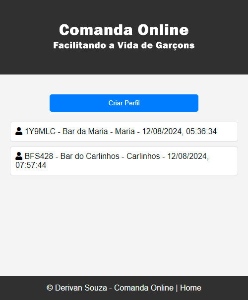
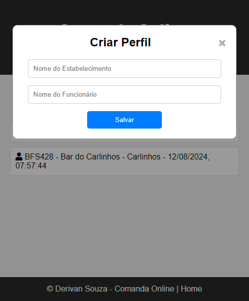
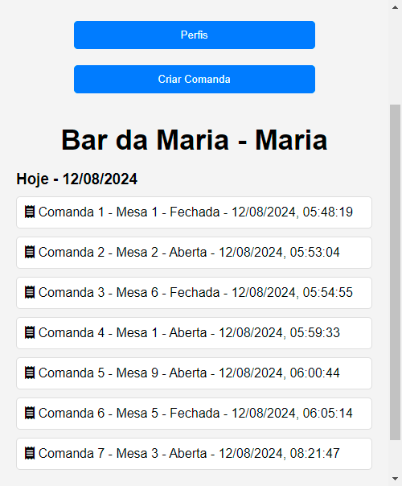
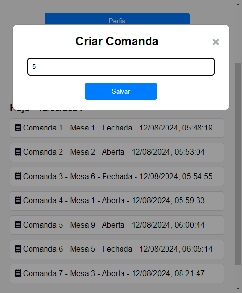
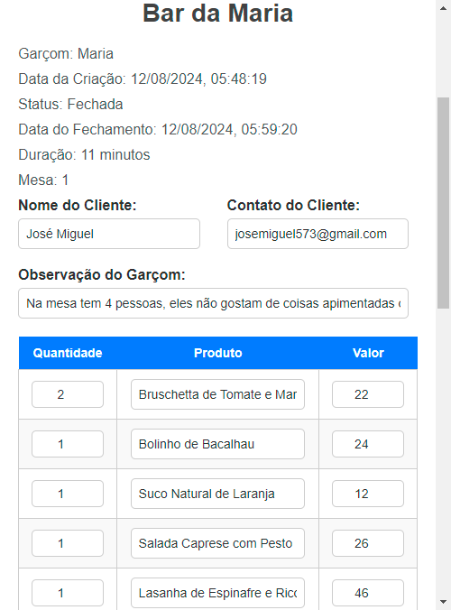
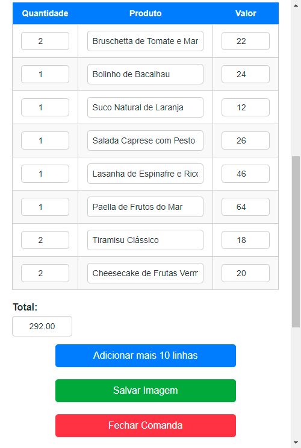
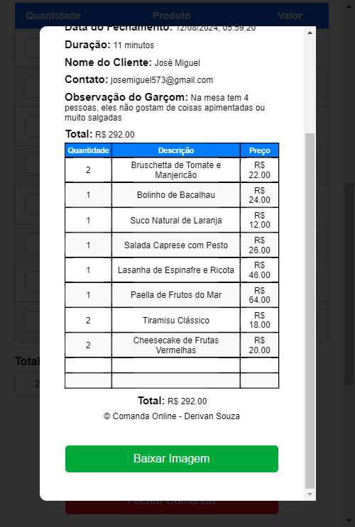
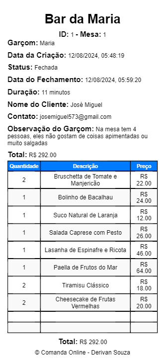
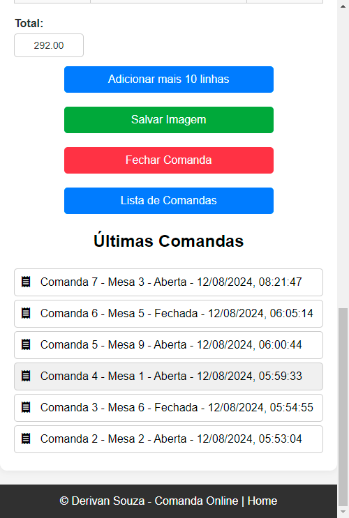

# Comanda Online

## Descrição

**Comanda Online** é um sistema para gerenciamento de comandas de restaurante de forma digital. Ele permite a criação, visualização e edição de comandas, facilitando a comunicação entre a equipe e melhorando a organização. O sistema está disponível online e pode ser acessado através do seguinte [site](https://derivansa.github.io/Comanda-Online/).

## Acesso

Para acessar o site, visite: [Comanda Online](https://derivansa.github.io/Comanda-Online/)

## Funcionalidades

### Página Inicial

Ao acessar o site, você será direcionado para a página inicial, onde é possível:
- Criar um perfil, inserindo o nome do estabelecimento e o nome do funcionário.
- Visualizar todos os perfis já criados.

### Perfil

Ao clicar em um perfil, você será levado para a página de comandas específica desse perfil, onde pode:
- Visualizar todas as comandas já criadas.
- Criar uma nova comanda, inserindo o número da mesa e salvando.

### Edição de Comanda

Ao clicar em uma comanda, você será direcionado para a página de visualização e edição, onde pode:
- Adicionar informações do cliente (nome, contato, observações).
- Preencher uma tabela com itens, quantidades e valores.
- Adicionar mais linhas à tabela, se necessário.
- Salvar uma imagem da comanda para enviar à cozinha.

### Fechamento de Comanda

Quando a comanda é fechada, a hora de fechamento e a duração são exibidas. Mesmo após o fechamento, você pode continuar a modificar a comanda se novas informações forem fornecidas.

### Lista de Comandas

O botão 'Lista de Comandas' leva você a uma lista com todas as comandas do perfil. Abaixo, há uma área que exibe as últimas 10 comandas criadas para acesso rápido.

### Página de Download

Na página de download, disponível em [Download](https://derivansa.github.io/Comanda-Online/download.html), você pode:
- **Baixar Todos os Perfis e Comandas:** Faz o download de um arquivo JSON contendo todas as informações.
- **Excluir Dados:** Remove todos os dados de perfis e comandas do navegador.
- **Baixar Cookies:** Faz o download dos perfis em um arquivo JSON.
- **Importar Arquivo JSON:** Permite importar um arquivo JSON com informações de perfis e comandas.
- **Atualizar Perfil:** Atualiza um perfil específico a partir de um arquivo JSON.

## Contribuição

Se você deseja contribuir para o projeto, sinta-se à vontade para abrir uma issue ou enviar um pull request no [repositório do GitHub](https://github.com/DerivanSa/Comanda-Online/).

## Licença

Este projeto está licenciado sob a [Licença MIT](LICENSE).

---

*Nota: Substitua `path/to/your/imageX.png` pelos caminhos reais das suas imagens.*
